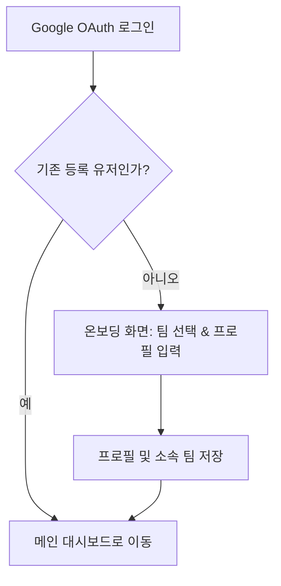
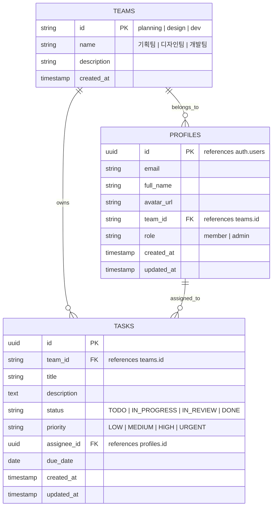

# 📋 업무현황 대시보드 기획서 (PRD)

> **문서 버전**: v1.0.0  
> **작성일자**: 2026-08-29  
> **문서 상태**: Approved (기획 확정)  
> **대상 플랫폼**: Web (Responsive Desktop/Tablet/Mobile)

---

## 1. 프로젝트 개요

### 1.1 배경 및 목적
- 사내 기획팀, 디자인팀, 개발팀 간의 업무 현황을 직관적으로 시각화하고 관리할 수 있는 대시보드 웹 애플리케이션입니다.
- **핵심 원칙**:
  - **팀별 업무 분리 및 보안(Team Isolation)**: 각 팀은 본인이 속한 팀의 상세 업무만 열람/수정할 수 있습니다.
  - **전사 통합 요약(Overview Summary)**: 메인 대시보드에서는 타 팀의 민감한 세부 업무 내용은 가리되, 팀별 진행률 및 주요 수치 통계(진행 중 건수, 마감 임박 건수 등)를 요약 시각화하여 전사적인 흐름을 파악할 수 있도록 합니다.
  - **심플 & 경량화**: 불필요하게 무거운 부가 기능(웹소켓 실시간 동기화, 대용량 파일 첨부 등)은 배제하고, 태스크 CRUD, 담당자, 마감일, 상태 관리에 집중한 빠르고 직관적인 워크플로우를 제공합니다.

---

## 2. 사용자 및 권한 체계 (Roles & Permissions)

### 2.1 사용자 구분
1. **일반 팀원 (Member)**
   - 소속 팀: 기획팀 / 디자인팀 / 개발팀 중 1개 선택
   - 메인 대시보드: 전사 팀별 집계 통계(수치) 확인 가능
   - 팀 대시보드: **본인이 속한 팀의 칸반/리스트만 접근 및 수정 가능** (타 팀 페이지 접근 차단)
2. **관리자 (Admin / Leader)**
   - 모든 팀의 상세 칸반 및 업무 열람/관리 가능
   - 팀원들의 소속 변경 및 권한 설정 가능

### 2.2 인증 및 온보딩 플로우

---

## 3. 화면별 상세 요구사항

### 3.1 로그인 및 온보딩 화면
- **구글 소셜 로그인 버튼**: Supabase Google OAuth 연동
- **최초 온보딩 프로필 설정**:
  - 사용자 닉네임 / 실명
  - 소속 팀 선택: `기획팀`, `디자인팀`, `개발팀`
  - 직책/역할 입력 (선택)

---

### 3.2 메인 종합 대시보드 (Overview)
- **전사 KPI 요약 카드**:
  - 전체 태스크 완료율 (%)
  - 전체 진행 중인 업무 수
  - 금주 마감 임박 업무 수
  - 팀별 총 태스크 수
- **팀별 진행 현황 요약 카드 (3개 팀)**:
  - **기획팀 현황 카드**: 전체 건수, 진행률(%), 진행 중/검토 중/완료 수치 게이지
  - **디자인팀 현황 카드**: 전체 건수, 진행률(%), 진행 중/검토 중/완료 수치 게이지
  - **개발팀 현황 카드**: 전체 건수, 진행률(%), 진행 중/검토 중/완료 수치 게이지
  - *(일반 팀원은 본인 팀 카드 클릭 시 해당 팀 상세 보드로 이동 가능, 타 팀은 '비공개' 안내 툴팁 또는 읽기 불가)*
- **내 업무 바로가기 (My Tasks Widget)**:
  - 로그인한 사용자가 담당자로 지정된 현재 진행 중인 태스크 목록 (본인 팀)

---

### 3.3 팀별 업무 관리 화면 (Team Workspace)
- **URL 구조**: `/teams/planning`, `/teams/design`, `/teams/development`
- **접근 제어 (Middleware / RLS)**:
  - 사용자의 소속 팀과 일치하지 않는 경우 접근 차단 (403 Forbidden 또는 메인으로 리다이렉트)
- **제공 뷰 (View Modes)**:
  1. **칸반 보드 (Kanban Board)**
     - 4개 컬럼: `대기 (TODO)`, `진행중 (IN_PROGRESS)`, `검토중 (IN_REVIEW)`, `완료 (DONE)`
     - 카드 정보: 태스크 제목, 담당자(아바타), 우선순위 배지, 마감일
     - 상태 변경: 드래그 앤 드롭 또는 상태 선택 팝오버
  2. **리스트 뷰 (List View)**
     - 테이블 형태 정렬 및 검색 지원 (상태, 우선순위, 담당자, 마감일 기준)
- **태스크 생성/수정 모달**:
  - 필수값: 태스크 제목, 상태, 우선순위 (`낮음`, `보통`, `높음`, `긴급`), 마감일
  - 선택값: 상세 설명(Markdown 지원 텍스트 에어리어), 담당 팀원 선택

---

## 4. 데이터베이스 및 엔티티 설계 (Supabase)

### 4.1 테이블 구조

### 4.2 Supabase RLS (Row Level Security) 정책
1. **`profiles` 테이블**:
   - 본인 프로필 조회 및 수정 가능
   - 같은 팀원의 프로필 기본 정보(이름, 아바타) 조회 가능
2. **`tasks` 테이블**:
   - **SELECT (상세 조회)**: 본인 소속 팀(`auth.jwt() -> team_id`)과 일치하거나 관리자인 경우에만 허용
   - **INSERT / UPDATE / DELETE**: 본인 소속 팀의 태스크만 생성, 수정, 삭제 가능
3. **`team_stats` (Database View 또는 RPC)**:
   - 메인 대시보드용으로 팀별 집계 데이터(`count(*) filter by status`)를 반환하는 안전한 통계 뷰/함수 제공

---

## 5. 기술 스택 및 아키텍처

| 영역 | 기술 스택 | 선정 이유 |
| :--- | :--- | :--- |
| **Framework** | Next.js 14+ (App Router) | React Server Component 기반 빠른 렌더링 및 Middleware 라우트 가드 지원 |
| **Language** | TypeScript (Strict Mode) | 정적 타입 검사 및 안정적인 인터페이스 보장 |
| **Styling** | Tailwind CSS, shadcn/ui, Lucide Icons | 모던하고 일관성 있는 디자인 시스템 구축 |
| **Database & Auth** | Supabase (PostgreSQL, GoTrue Auth) | Google OAuth 및 Row Level Security(RLS)를 통한 강력한 팀 데이터 격리 |
| **Chart** | Recharts | 가볍고 커스터마이징이 용이한 차트 시각화 |

---

## 6. 개발 로드맵 (Milestones)

- [ ] **Phase 1. 프로젝트 셋업 및 Supabase 연동**
  - Next.js 14 + Tailwind CSS + shadcn/ui 초기화
  - Supabase Auth (Google OAuth) 및 데이터베이스 마이그레이션 스크립트 작성
- [ ] **Phase 2. 인증 및 온보딩 구현**
  - Google 로그인 페이지 & 온보딩(소속 팀 선택) 화면
  - Next.js Auth Middleware (미로그인 및 타 팀 접근 차단 가드)
- [ ] **Phase 3. 팀별 업무 관리 화면 (Workspace)**
  - 칸반 보드 및 리스트 뷰 구현
  - 태스크 CRUD 모달 및 상태 업데이트 기능
- [ ] **Phase 4. 메인 종합 대시보드 (Overview)**
  - 전사 KPI 통계 위젯 및 팀별 요약 차트 구현
  - 내 할 일(My Tasks) 빠른 위젯 연결
- [ ] **Phase 5. 최종 검증 및 배포**
  - 권한/보안(RLS) 테스트 및 반응형 UI 점검
  - Vercel 배포 연동
